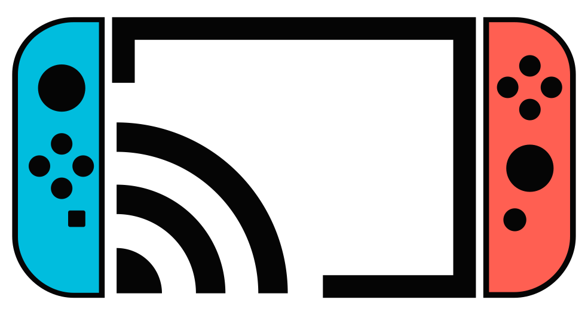

# NX-Cast

<p align="center">
  
</p>

`NX-Cast` is a Nintendo Switch homebrew media receiver for Atmosphere.

The current product target is a solid generic `DLNA DMR` receiver: phones, desktop players, and TV apps send a media URL through DLNA, and the Switch plays it through `libmpv`.

## Current Status

The current baseline includes:

- DLNA discovery through `SSDP`
- runtime `Description.xml` and service `SCPD`
- `SOAP` actions for `SetAVTransportURI`, `Play`, `Pause`, `Stop`, `Seek`, and volume
- `GENA` event subscriptions and `LastChange`
- protocol state synced from the real playback session
- `libmpv` backend with `ao=hos`
- `deko3d/libmpv render API` as the preferred video path
- runtime `hwdec=nvtegra` preference when the installed media toolchain supports it
- static home screen with cast instructions and last-error display
- controller and touch playback overlay
- Docker and GitHub Actions release builds

This project is still experimental Switch homebrew. Current development is focused on DLNA interoperability, playback stability, and the player UI.

## What It Is Not

`NX-Cast` is not currently:

- a DLNA media server (`DMS`)
- a DLNA media controller (`DMC`)
- an AirPlay receiver
- a source-native app for iQiyi, MangoTV, CCTV, Bilibili, or IPTV
- a DRM bypass or site login implementation

The playback path intentionally stays thin: DLNA provides the URL, then `libmpv/FFmpeg` handles probing, networking, demuxing, decoding, and playback.

## Install

Use the release package when possible:

1. Download `NX-Cast-sdmc.zip` from the GitHub Release.
2. Extract it to the root of the Switch SD card.
3. Launch `switch/NX-Cast/NX-Cast.nro` from `hbmenu`.

The package layout is:

```text
switch/NX-Cast/NX-Cast.nro
switch/NX-Cast/dlna/
```

`switch/NX-Cast/dlna/` contains the runtime DLNA XML, CSV, HTML, and icon assets.

## Controls

When idle, the app shows a home screen with basic casting instructions, runtime status, and only the latest error. Full log history is kept for debugging but is not shown as the release foreground UI.

During video playback:

- `A`: play / pause
- `+`: exit the app
- `-`: show controls
- `L` or `Left`: seek backward 10 seconds
- `R` or `Right`: seek forward 10 seconds
- `Up` / `Down`: volume up / down
- left or right stick horizontal: seek
- left or right stick vertical: volume
- touch screen tap: show controls
- touch center button while controls are visible: play / pause
- touch and drag the progress bar: preview target time, release to seek

## Architecture

```text
main
  -> protocol/dlna
       -> discovery
       -> description
       -> control
       -> protocol_state
  -> protocol/http
  -> player
       -> core
       -> backend
       -> render
       -> ui
```

Important state flow:

```text
SetAVTransportURI
  -> renderer_set_uri
  -> libmpv loadfile
  -> libmpv properties/events
  -> PlayerSnapshot / PlayerEvent
  -> protocol_state
  -> SOAP query / GENA notify
```

Protocol commands go down to the player. Real runtime state comes back up from the player and becomes the protocol-observed state.

## Build

### Recommended: Docker

This is the easiest path. It uses the same media packages as GitHub Actions and produces a release-ready SD package.

```bash
./scripts/docker_build_release.sh
```

Outputs:

```text
dist/NX-Cast.nro
dist/NX-Cast-sdmc.zip
```

The Docker build installs the current recommended `wiliwili` media packages:

- `libuam`
- `switch-ffmpeg`
- `switch-libmpv_deko3d`

### Local devkitPro Build

Requirements:

- `devkitPro`
- `devkitA64`
- `libnx`
- `switch-libmpv_deko3d`
- `switch-ffmpeg`
- `libuam`

Install the current recommended prebuilt media packages:

```bash
base_url="https://github.com/xfangfang/wiliwili/releases/download/v0.1.0"
sudo dkp-pacman -U \
  "$base_url/libuam-f8c9eef01ffe06334d530393d636d69e2b52744b-1-any.pkg.tar.zst" \
  "$base_url/switch-ffmpeg-7.1-1-any.pkg.tar.zst" \
  "$base_url/switch-libmpv_deko3d-0.36.0-2-any.pkg.tar.zst"
```

Build:

```bash
source /opt/devkitpro/switchvars.sh
make NXCAST_REQUIRE_LIBMPV=1 NXCAST_REQUIRE_DEKO3D=1 -j2
NXCAST_MIN_NRO_SIZE=5000000 ./scripts/package_release.sh
```

The strict flags prevent accidentally producing a tiny mock/fallback `NRO` without `libmpv/deko3d`.

Trace build for playback/input debugging:

```bash
source /opt/devkitpro/switchvars.sh
make TRACE_MEDIA=1 TRACE_INPUT=1 NXCAST_REQUIRE_LIBMPV=1 NXCAST_REQUIRE_DEKO3D=1 -j2
```

The trace flags are optional build variables, not the default build mode. Use them for reproducing UI stutter, touch handling, SOAP/player state drift, or hard-to-read playback failures.

## CI/CD

GitHub Actions uses the same Dockerfile and media package versions as local Docker builds.

Development build:

```bash
git push
```

Any branch push builds the project and updates the rolling prerelease:

- Release name: `NX-Cast Continuous`
- Tag: `continuous`
- Assets: `NX-Cast.nro`, `NX-Cast-sdmc.zip`

Formal release:

```bash
git tag v0.1.0
git push origin v0.1.0
```

The release workflow requires `libmpv/deko3d` and rejects obviously invalid small `NRO` outputs.

## Repository Layout

```text
assets/
  dlna/        runtime DLNA templates copied to SD
  icon/        NRO icon sources
docs/          design notes and implementation plans
scripts/       build, packaging, nxlink, smoke tests
source/
  log/
  player/
    backend/
    core/
    render/
    ui/
  protocol/
    dlna/
    http/
```

Generated directories are ignored:

```text
build/
dist/
sdmc/
artifacts/
logs/
```

## Documentation

Start with [docs/README.md](docs/README.md).

Recommended order:

1. [docs/dmr-implementation.md](docs/dmr-implementation.md)
2. [docs/player-layer.md](docs/player-layer.md)
3. [docs/render-design.md](docs/render-design.md)
4. [docs/scpd-module.md](docs/scpd-module.md)
5. [docs/iptv-gui-plan.md](docs/iptv-gui-plan.md)

If documentation and source disagree, the current `source/` tree is authoritative.
