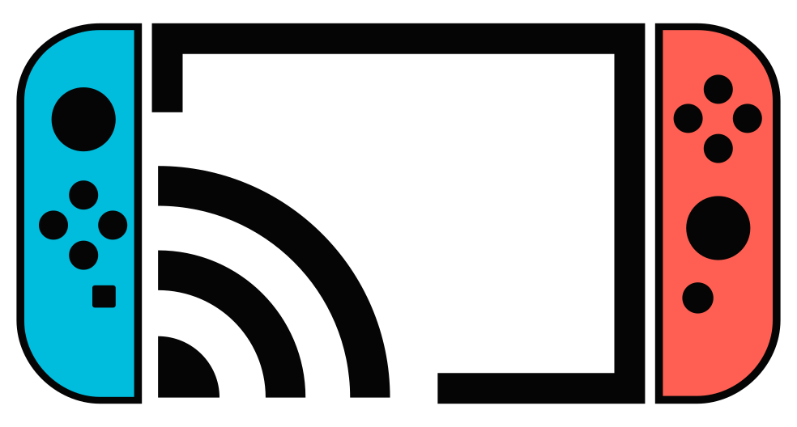

# NX-Cast

<p align="center">
  
</p>

`NX-Cast` is a Nintendo Switch homebrew DLNA receiver, IPTV player, and experimental AirPlay video receiver for Atmosphere.

It accepts media URLs from phones, desktop players, and TV apps as a generic `DLNA DMR`, and it can independently browse and play local or remote M3U IPTV sources. Both paths use the same hardware-accelerated `libmpv` playback session.

## Current Status

The current baseline includes:

- DLNA discovery through `SSDP`
- runtime `Description.xml` and service `SCPD`
- `SOAP` actions for `SetAVTransportURI`, `Play`, `Pause`, `Stop`, `Seek`, and volume
- `GENA` event subscriptions and `LastChange`
- protocol state synced from the real playback session
- `libmpv` backend with `ao=hos`
- `deko3d/libmpv render API` as the preferred video path
- runtime `hwdec=nvtegra` preference when the installed media toolchain supports it
- static home screen with cast instructions and last-error display
- local/remote M3U source management, SD cache, and direct IPTV URL input
- channel groups, search, favorites, recent history, logo cache, and XMLTV now/next EPG
- Simplified Chinese channel/programme metadata and text subtitles through the packaged Source Han font
- controller and touch playback overlay
- experimental AirPlay PIN pairing, direct/reverse HLS playback, and H.264 mirroring
- generation-safe media ownership across DLNA, IPTV, and AirPlay
- Docker and GitHub Actions release builds

This project is still experimental Switch homebrew. DLNA and IPTV are the current release features. AirPlay URL/HLS and screen mirroring are implemented and advertised by compatible builds, but both remain pending the real iPhone/Switch acceptance matrix.

## What It Is Not

`NX-Cast` is not currently:

- a DLNA media server (`DMS`)
- a DLNA media controller (`DMC`)
- a complete, Apple-certified AirPlay or AirPlay 2 receiver
- a source-native app or channel provider for iQiyi, MangoTV, CCTV, or Bilibili
- a DRM bypass or site login implementation

The playback path intentionally stays thin: DLNA provides the URL, then `libmpv/FFmpeg` handles probing, networking, demuxing, decoding, and playback.

## IPTV

IPTV is a supported release feature, not a separate experimental build. NX-Cast can import local or remote M3U/M3U8 playlists, classify channel lists versus direct HLS streams, cache remote sources on the SD card, and browse channels from the Home screen or over a playing video.

The IPTV browser includes playlist groups, search, Favorites, Recent, persistent source management, asynchronous logo caching, and plain/gzip XMLTV current/next programme information. Users provide their own authorized playlists and optional programme-guide URLs; NX-Cast does not bundle subscription access or bypass DRM.

See [docs/iptv.md](docs/iptv.md) for supported formats, SD-card paths, source configuration, controls, and current limitations.

## Experimental AirPlay

NX-Cast has an independent C implementation of AirPlay DNS-SD discovery, PIN pairing, persistent RTSP/HTTP control, reverse PTTH events, URL/HLS player commands, and H.264 mirroring. Absolute media URLs load directly; sender-relative HLS playlists are acquired through bounded FCUP events and exposed only through generation-bound loopback routes. It passes deterministic host tests and strict Switch cross-compilation, but real iPhone compatibility has not yet completed the release matrix. Treat it as experimental rather than a guaranteed release feature.

The H.264/AAC/ALAC mirror transport and nvtegra/deko3d bridge use an isolated GPL PlayFair compatibility backend sourced from a fixed UxPlay commit. Audio SETUP may arrive before video and is promoted to a new A/V bridge generation when type-110 video arrives, without mutating libmpv from a network thread. Automated protocol, media, sanitizer, and Switch builds do not establish real-iPhone compatibility or Apple authorization. AirPlay 2 multi-room audio, music-player behavior, AWDL, HEVC mirroring, commercial FairPlay/DRM content, and Apple certification are out of scope.

See [docs/AIRPLAY_DEVELOPMENT.md](docs/AIRPLAY_DEVELOPMENT.md) for the capability table, SD privacy rules, build requirements, and hardware matrix. The stable route and ownership contract is documented in [docs/AIRPLAY_PROTOCOL_COMPATIBILITY.md](docs/AIRPLAY_PROTOCOL_COMPATIBILITY.md).

## Install

Use the SD card package when possible:

1. Download `NX-Cast-sdmc.zip` from the GitHub Release.
2. Extract it to the root of the Switch SD card.
3. Launch `switch/NX-Cast/NX-Cast.nro` from `hbmenu`.

The package layout is:

```text
switch/
  NX-Cast/
    NX-Cast.nro
    dlna/
    fonts/
    iptv/
    airplay/
    licenses/
```

`NX-Cast-sdmc.zip` is already laid out like the SD card. Extract it directly to the SD root; do not put it inside an extra nested folder.

`switch/NX-Cast/dlna/` contains runtime DLNA XML, CSV, HTML, and icon assets. `switch/NX-Cast/fonts/` contains the packaged Chinese UI/subtitle font. Put local `.m3u` or `.m3u8` playlists in `switch/NX-Cast/iptv/`. AirPlay identity and trusted pairings are generated privately in `switch/NX-Cast/airplay/` and must not be shared.

For full install and troubleshooting details, see [docs/install.md](docs/install.md).

## Controls

The home screen separates passive casting status from the actionable Live TV card. Casting starts from the phone; the left card is not a button. Chinese/English UI language follows the system initially and can be changed on Home. The preference is saved on the SD card. Only the latest error appears on Home, not the full debug log.

On the home screen:

- `A`: activate the focused Home control; Live TV is focused initially
- `X` or either stick click: open the full-screen channel library
- `Up` / `Down`: focus the language control / Live TV card
- `B`: return to an active player from Home
- `Y`: refresh sources in the background
- `-`: open a media or M3U URL; playlist URLs are imported into Channels instead of played as one stream

Inside the channel library or playback drawer:

- Directional buttons or either stick browse continuously; holding accelerates scrolling
- Left/right (or `L`/`R`) moves between the filter toolbar, channel list, and bottom actions, not playback seek
- `A` / `SR`: activate the focused action or play the selected channel; `Y` toggles Favorite
- `B` / `SL`: close a selector, return from Sources, collapse the full list to the playback drawer, or close the browser
- `X` expands the playback drawer to the full list without stopping playback
- Categories, Favorites, Recent, Search and Sources are accessible through the toolbar
- Sources includes source filtering and management: Add URL, Scan SD, Refresh, Programme guide and Delete
- Touch: drag with inertia or drag the scrollbar, tap a row to select it, then tap Play. Scrolling never automatically plays a channel

NX-Cast accepts input from every connected standard controller. A single horizontal Joy-Con can browse with its stick, click the stick to open IPTV, use `SR` to confirm, and use `SL` to return. A paired Joy-Con set, handheld controls, Pro Controller, and touch screen can each complete channel selection independently.

During video playback:

- `A`: play / pause
- `B`: return to Home without stopping playback
- `X` or either stick click: open the IPTV channel drawer over the current video; `A` switches channel and `B` closes the menu. DLNA/AirPlay do not show this IPTV-only action
- `+`: exit the app
- `-`: show controls
- `L` or `Left`: seek backward 10 seconds
- `R` or `Right`: seek forward 10 seconds
- `Up` / `Down`: volume up / down
- left or right stick horizontal: seek
- left or right stick vertical: volume
- touch screen tap: show controls
- touch center button while controls are visible: play / pause
- touch and drag the progress bar: preview target time, release to seek

## Architecture

```text
main
  -> iptv
       -> local/remote M3U cache and classification
       -> channel filters, favorites, logos, and XMLTV EPG
  -> protocol/dlna
       -> discovery
       -> description
       -> control
       -> protocol_state
  -> protocol/airplay
       -> discovery + persistent control + pairing
       -> URL/HLS remote video
       -> mirror media bridge (experimental)
  -> protocol/http
  -> player
       -> core
       -> backend
       -> render
       -> ui
```

Important state flow:

```text
SetAVTransportURI
  -> renderer_set_uri
  -> libmpv loadfile
  -> libmpv properties/events
  -> PlayerSnapshot / PlayerEvent
  -> protocol_state
  -> SOAP query / GENA notify
```

Protocol commands go down to the player. Real runtime state comes back up from the player and becomes the protocol-observed state.

## Build

### Recommended: Docker

This is the easiest path. It uses the same media packages as GitHub Actions and produces a release-ready SD package.

```bash
./scripts/docker_build_release.sh
```

Outputs:

```text
dist/NX-Cast-sdmc.zip
```

The Docker build installs the current recommended `wiliwili` media packages:

- `libuam`
- `switch-ffmpeg`
- `switch-libmpv_deko3d`

It then downloads NX-Cast's pinned, SHA-256-verified FFmpeg package with the
Matroska muxer and Switch-native random source for the AirPlay bridge. The
build also installs official devkitPro
`switch-libsodium` and runs the AirPlay host suite before the strict Switch
build.

### Local devkitPro Build

Requirements:

- `devkitPro`
- `devkitA64`
- `libnx`
- `switch-libmpv_deko3d`
- `switch-ffmpeg`
- `libuam`
- `switch-libsodium`

Install the official AirPlay crypto dependency through devkitPro pacman:

```bash
sudo dkp-pacman -S --needed switch-libsodium
```

Install the current recommended prebuilt media packages:

```bash
base_url="https://github.com/xfangfang/wiliwili/releases/download/v0.1.0"
sudo dkp-pacman -U \
  "$base_url/libuam-f8c9eef01ffe06334d530393d636d69e2b52744b-1-any.pkg.tar.zst" \
  "$base_url/switch-ffmpeg-7.1-1-any.pkg.tar.zst" \
  "$base_url/switch-libmpv_deko3d-0.36.0-2-any.pkg.tar.zst"
```

Download and globally install NX-Cast's pinned FFmpeg package for AirPlay
H.264/AAC/ALAC bridging:

```bash
source /opt/devkitpro/switchvars.sh
make install-airplay-ffmpeg
make verify-airplay-ffmpeg
```

The install target fetches a fixed GitHub Release asset, verifies its SHA-256,
then requests `sudo` only for `dkp-pacman -U`. To change or rebuild FFmpeg,
run `make build-airplay-ffmpeg` separately. Matroska is a compile-time FFmpeg
muxer, not an SD-card asset or a runtime plugin.

Build:

```bash
source /opt/devkitpro/switchvars.sh
make RELEASE_JOBS=2 release-build
NXCAST_MIN_NRO_SIZE=5000000 ./scripts/package_release.sh
```

`release-build` requires Dear ImGui, libmpv, deko3d, AirPlay Ed25519, the
built-in PlayFair backend, and FFmpeg ALAC/H.264/Matroska support, then writes
the build attestation required by the packaging script. This prevents a
fallback, AirPlay-disabled, or muxer-less NRO from being published accidentally.
Use the individual flags only for development builds.

Trace build for playback/input debugging:

```bash
source /opt/devkitpro/switchvars.sh
make TRACE_MEDIA=1 TRACE_INPUT=1 TRACE_AIRPLAY=1 NXCAST_USE_IMGUI_UI=1 NXCAST_REQUIRE_LIBMPV=1 NXCAST_REQUIRE_DEKO3D=1 NXCAST_REQUIRE_AIRPLAY_ED25519=1 -j2
```

The trace flags are optional build variables, not the default build mode. Use them for reproducing UI stutter, touch handling, SOAP/player state drift, or hard-to-read playback failures.

## CI/CD

GitHub Actions uses the same Dockerfile and media package versions as local Docker builds.

Development build:

```bash
git push
```

A push to `main` builds the project and updates the rolling prerelease. Pull requests targeting `main` build without publishing:

- Release name: `NX-Cast Continuous`
- Tag: `continuous`
- Asset: `NX-Cast-sdmc.zip` (complete installation folder, including the NRO)

Formal release:

```bash
git tag -a v0.3.1 -m "NX-Cast v0.3.1"
git push origin v0.3.1
```

The release workflow runs AirPlay host tests, requires `libmpv/deko3d` plus Ed25519, rejects obviously invalid small `NRO` outputs, and rejects packages containing runtime AirPlay secrets or diagnostic captures.

See [CHANGELOG.md](CHANGELOG.md) for version history and release details.

## Repository Layout

```text
assets/
  airplay/     runtime storage/privacy notice
  dlna/        runtime DLNA templates copied to SD
  icon/        NRO icon sources
  iptv/        IPTV source examples and packaged presets
  licenses/    packaged third-party notices
docs/          design notes and implementation plans
scripts/       build, packaging, nxlink, smoke tests
source/
  iptv/
  log/
  player/
    backend/
    core/
    render/
    ui/
  protocol/
    dlna/
    http/
```

Generated directories are ignored:

```text
build/
dist/
sdmc/
artifacts/
logs/
```

## Documentation

Start with [docs/README.md](docs/README.md).

Recommended order:

1. [docs/dmr-implementation.md](docs/dmr-implementation.md)
2. [docs/player-layer.md](docs/player-layer.md)
3. [docs/render-design.md](docs/render-design.md)
4. [docs/scpd-module.md](docs/scpd-module.md)
5. [docs/iptv.md](docs/iptv.md)
6. [docs/iptv-gui-plan.md](docs/iptv-gui-plan.md)
7. [docs/AIRPLAY_DEVELOPMENT.md](docs/AIRPLAY_DEVELOPMENT.md)

If documentation and source disagree, the current `source/` tree is authoritative.
