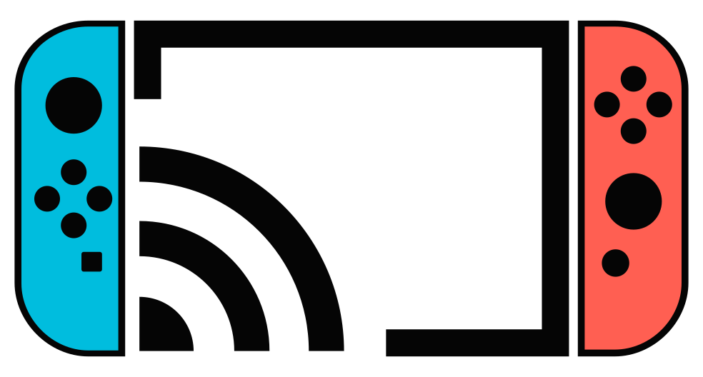

# NX-Cast

<p align="center">
  
</p>

**面向 Nintendo Switch Homebrew 的开源媒体中心。**

手机投屏、电视直播、iPhone 屏幕镜像，共用一套支持硬件解码的播放器。NX-Cast 集成 DLNA、IPTV 和实验性 AirPlay，无需为不同播放方式切换软件。

[下载 v0.3.2](https://github.com/Ode1l/NX-Cast/releases/tag/v0.3.2) | [最新正式版](https://github.com/Ode1l/NX-Cast/releases/latest) | [English](README.md)

## 功能

| 模式 | 可以做什么 |
|---|---|
| DLNA | 接收兼容应用的媒体投送，在手机端控制播放、暂停、跳转和音量。 |
| 电视直播 / IPTV | 导入本地或远程 M3U/M3U8 列表，按分类、搜索、收藏和最近观看找频道，播放时直接换台。 |
| AirPlay（实验性） | 接收兼容应用的视频 URL/HLS 投送，或通过 PIN 配对进行带声音的 iPhone 屏幕镜像。 |

- libmpv、FFmpeg、nvtegra 和 deko3d 硬件加速播放。
- 中英文界面，中文频道名、节目名称和文本字幕。
- 手柄和触摸控制，支持单只 Joy-Con 浏览选台。
- 直播源提供相应信息时，显示台标、当前和下一节目。
- 在 SD 卡保存直播源、收藏、观看历史和缓存。
- 主页显示投屏状态和最近一条错误，不展示调试控制台。

### 0.3.2 更新

iPhone 屏幕镜像已支持声音，包括画面开始后才加入音频的情况。本版修复镜像闪退和音视频时钟处理，改进媒体流切换，并使用修正后的 Switch FFmpeg 7.1-4。镜像时隐藏进度条，频道菜单提示仅在 IPTV 播放时显示。

DLNA 和 IPTV 是正式支持的功能。**AirPlay 仍为实验性功能**：虽然已经过真实 iPhone/Switch 测试，但不同应用和媒体格式的表现可能不同，不代表完整 AirPlay 2 支持或 Apple 认证。

完整版本历史见 [CHANGELOG.md](CHANGELOG.md)。

## 安装

需要运行 Atmosphère/Homebrew 环境、可进入 hbmenu 的 Nintendo Switch。

1. 从[最新正式版](https://github.com/Ode1l/NX-Cast/releases/latest)下载 **NX-Cast-sdmc.zip**。
2. 直接解压到 Switch SD 卡根目录。
3. 在 hbmenu 中启动 NX-Cast。

保留完整目录：

```text
switch/
  NX-Cast/
    NX-Cast.nro
    dlna/
    fonts/
    iptv/
      sources.txt
    airplay/
    licenses/
```

不要额外套一层文件夹。字体和 DLNA 资源已包含在包中，**普通用户不需要单独安装 FFmpeg**。

更新前请备份自定义设置和直播源。AirPlay 身份及可信配对文件由软件在你的 Switch 上生成，位于 `switch/NX-Cast/airplay/`；不要公开分享，也不要放进安装包或问题反馈中。

**日常使用不要下载 Continuous。** 它是用于维护者指定测试的滚动开发版，不是正式版。

详细安装和排错说明见 [docs/install.md](docs/install.md)。

## 开始使用

### 手机投屏

Switch 与手机连接到同一局域网，并保持 NX-Cast 运行。

- **DLNA：**在兼容应用的投屏或设备选择菜单中选择 NX-Cast。
- **AirPlay 视频：**在兼容应用的 AirPlay 菜单中选择 NX-Cast。
- **iPhone 屏幕镜像：**打开控制中心，选择“屏幕镜像”，再选择 NX-Cast。需要配对时输入 Switch 显示的 PIN。

主页的投屏卡片是状态展示，不是按钮；投屏从手机发起。软件不支持单独的 AirPlay 音频/音乐播放，应用选择仅音频输出与屏幕镜像或视频投送不是同一回事。

### 电视直播

在主页按 `A`、`X` 或触摸打开**电视直播**。添加直播源有三种方式：

- 将本地 `.m3u` / `.m3u8` 文件复制到 `switch/NX-Cast/iptv/`，软件启动时自动扫描。
- 在**直播源 > 管理直播源 > 添加网址**中输入远程播放列表地址。
- 将长网址预先写入 `switch/NX-Cast/iptv/sources.txt`，避免在 Switch 上手动输入。

`sources.txt` 示例：

```text
https://example.com/channels.m3u
My IPTV | https://example.com/channels.m3u | https://example.com/guide.xml
```

第三列是可选节目单网址，也可以自动导入播放列表中声明的节目单。节目单只提供节目介绍和时间，并不代替视频地址。

发布包的 `sources.txt` 包含公共预设；能否播放取决于直播源、网络和访问权限。频道库按内存预算增长，不再以固定页数为上限；大量频道建议使用分类、直播源筛选和搜索。

格式、节目匹配和 SD 存储详情见 [docs/iptv.md](docs/iptv.md)。

## 操作

| 界面 | 手柄 | 触摸 |
|---|---|---|
| 主页 | `A`：打开焦点选项；`X` / 摇杆按下：电视直播；上下：语言 / 电视直播；`Y`：刷新直播源；`-`：输入网址；`B`：返回正在播放的画面 | 点击电视直播或语言切换 |
| 频道列表 | 方向键 / 任一摇杆：浏览；`L/R` 或左右：切换工具栏、列表和操作区焦点；`A/SR`：确认；`Y`：收藏；`B/SL`：返回 | 滑动列表（支持惯性）或拖动滚动条；选中频道后点击播放 |
| 播放器 | `A`：播放/暂停；`L/R` 或左右：跳转 10 秒；上下：音量；`-`：显示控制栏；`B`：主页；`+`：退出 | 点击显示/隐藏控制栏；点击中央按钮播放/暂停；拖动进度条预览，松手跳转 |
| IPTV 播放 | `X` / 摇杆按下：频道侧栏；`X`：完整列表；`A`：换台；`B`：返回 | 使用频道侧栏及完整列表入口 |

播放时任一摇杆横向控制跳转，纵向调节音量；长按跳转键可连续移动。跳转和进度条需要媒体支持，电视直播和屏幕镜像不显示点播时间轴。DLNA/AirPlay 播放时不显示 IPTV 专用频道按钮。

单只横握 Joy-Con、双 Joy-Con、掌机模式、Pro Controller 和触摸屏均可独立浏览和选台。单 Joy-Con 使用 `SR` 确认、`SL` 返回。主页支持中英文切换，语言偏好保存到 SD 卡。

## 兼容性与边界

NX-Cast 是 Homebrew 媒体接收器和播放器，不是 DLNA 媒体服务器、媒体控制器，也不是任何视频网站的原生客户端。

- 不提供付费账号、DRM 绕过或地域限制绕过。
- 不支持完整 AirPlay 2 多房间功能、单独音频/音乐播放、AWDL 或 HEVC 镜像。
- 不保证所有应用或受保护内容都能投屏。
- IPTV 目前显示当前/下一节目，尚不支持录制、时移或全天节目单网格。

请使用你有权访问的直播源和媒体。AirPlay 能力和协议说明见 [docs/AIRPLAY_DEVELOPMENT.md](docs/AIRPLAY_DEVELOPMENT.md) 与 [docs/AIRPLAY_PROTOCOL_COMPATIBILITY.md](docs/AIRPLAY_PROTOCOL_COMPATIBILITY.md)。

## 编译

以下面向开发者，普通用户只需要安装 ZIP。

### Docker

Docker 与 GitHub Actions 使用同一套媒体依赖配方：

```bash
./scripts/docker_build_release.sh
```

输出：`dist/NX-Cast-sdmc.zip`。

镜像使用[固定的媒体工具链](docs/ffmpeg-mpv-toolchain.md)，FFmpeg 下载后会校验 SHA-256，再进行安装。

### 本地 devkitPro

先按[工具链安装教程](docs/ffmpeg-mpv-toolchain.md#install-prebuilt-packages)准备依赖。
依赖版本和安装步骤统一在该文档维护，分别说明 **macOS** 和 **Windows MSYS2** 环境。
macOS 安装包使用 `sudo dkp-pacman`；Windows MSYS2 使用 `pacman`，不使用 `sudo`。

配置完成后，在仓库根目录运行。以下适用于 macOS 或已配置好的 MSYS2 Bash：

```bash
bash scripts/dev.sh build
```

如果使用 Windows PowerShell，则运行：

```powershell
powershell.exe -NoProfile -ExecutionPolicy Bypass -File scripts/dev.ps1 build
```

默认使用四个编译任务。普通构建关闭 Trace，并自动准备缺失或过旧的固定版 FFmpeg；已经正确安装时直接复用。
安装范围、缓存和独立工具链选项见[依赖自动准备说明](docs/ffmpeg-mpv-toolchain.md#automatic-ffmpeg-preparation)。

VS Code 入口、Full Trace、上传、本地打包及 GitHub 发布统一见[开发工作流](docs/developer-workflow.md)。
Windows 使用轻量 PowerShell/MSYS2 适配层，原生 Windows 实机验证仍待完成。

### GitHub Actions

- 推送到 `main`：测试、构建、打包，并更新 **DO NOT DOWNLOAD - NX-Cast Continuous (Development Build)** 预发布。
- 面向 `main` 的 Pull Request：构建但不发布。
- 新的 `v*` tag：触发正式发布流程，上传完整 SD ZIP。

工具链镜像按依赖内容缓存到 GHCR，依赖未变时直接复用。普通应用构建下载预编译 FFmpeg 包，不会每次从头编译 FFmpeg。

新版本发布前需要先更新版本元数据。已发布的 `v0.3.2` tag 无需重新创建或移动。构建与发布基础设施见 [docs/ci-toolchain.md](docs/ci-toolchain.md)。

## 文档与许可证

从 [docs/README.md](docs/README.md) 开始阅读，里面有播放器、渲染和线程设计文档。安装及 IPTV 使用说明已在上方链接。

许可证和第三方依赖见 [LICENSE](LICENSE) 与 [third_party/NOTICE.md](third_party/NOTICE.md)。实验性 AirPlay 使用固定源码的 GPL PlayFair 兼容后端，并不代表获得 Apple 认证。
